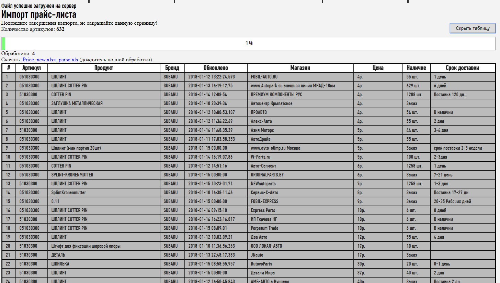

# Parse-zzap.ru

## Парсер, который собирает собирает информацию с сайта Zapp.ru.
#### Задача: Имеется список товаров с артикулами, которые присутствуют на сайте zapp.ru. Нужно достать информацию о первых 20 товарахи сравнить с товаром нашего магазина и вывести позицию нашего товара. На этой основе будет видно, какие товары нужно сделать дешевле, чтобы подняться на первую позицию по цене. Если наш магазин в топ10, то не проверять больше 20 позиций.  
#### Всю информацию записывать в xls файл с возможностью загрузки.

Решение:
##### <a href="index.php">index.php</a> 
##### <a href="index.php">xlsPHP.php</a> - Считывание Артикулов
##### <a href="index.php">parseZZAP.php</a> - Парсинг данных с сайта zzap.ru

